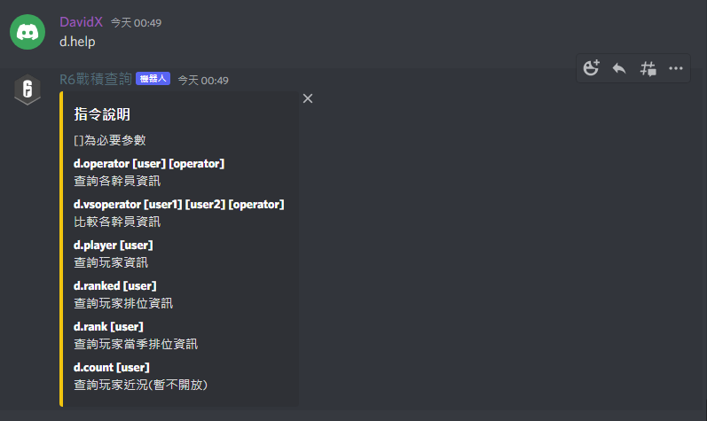
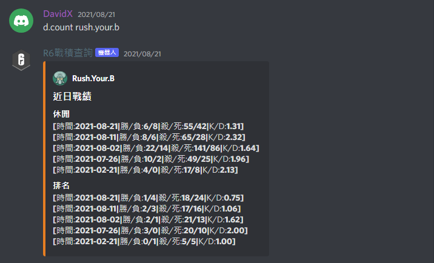
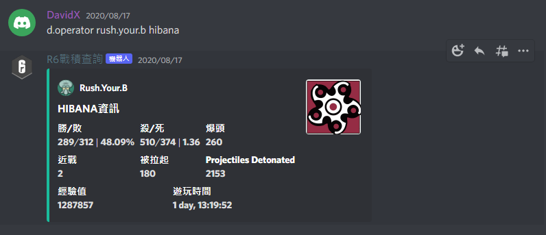
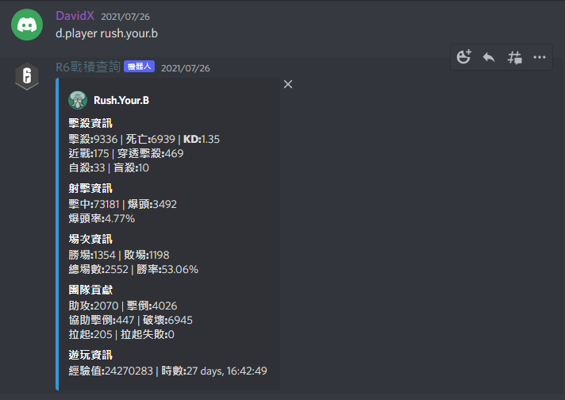
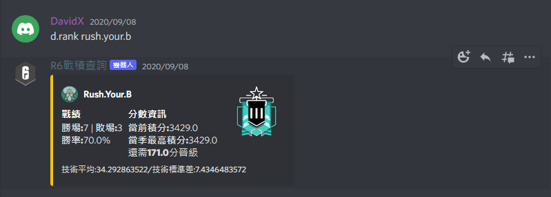
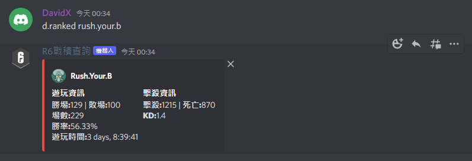
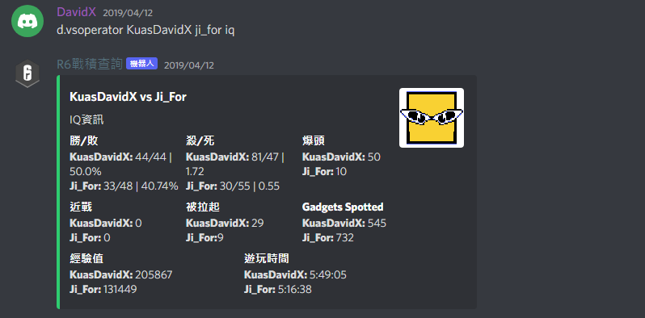

# R6Discord-Bot

### Codenvy ubuntu 14.04.5 虛擬機安裝參考
#### 安裝python3.5
    sudo add-apt-repository ppa:fkrull/deadsnakes
    sudo apt-get update
    sudo apt-get install python3.5

#### 安裝完切換版本設定
    sudo update-alternatives --install /usr/bin/python3 python3 /usr/bin/python3.4 1
    sudo update-alternatives --install /usr/bin/python3 python3 /usr/bin/python3.5 2
    
    sudo update-alternatives --config python3

#### 安裝pip
    sudo apt-get updat
    sudo apt-get install python-dev
    sudo apt-get install python3-pip
    sudo pip3 install --upgrade setuptools

#### 安裝discord.py
    sudo python3 -m pip install -U discord.py
    sudo python3 -m pip install idna_ssl
    sudo python3 -m pip install typing_extensions

### 2019/08/12更新
部屬至Heroku
===========
* 新增Procfile檔案 內容 worker: python main.py (worker: [語言] [檔案])
* 新增requirements.txt 內容放置需要的python套件
* Heroku可設置環境變數 R6帳號密碼與Discord token移轉至Heroku環境變數
* Deploy之後至Heroku->Resources 開啟Worker

### 2022/07/17 Update
Deploy to Raspberry pi 4
===========
* Stop using PostgreSQL and "count" function
* Update "help" content

Feature
===========

#### 參考
* [discord.py](https://github.com/Rapptz/discord.py)    
* [r6sapi](https://github.com/billy-yoyo/RainbowSixSiege-Python-API)

