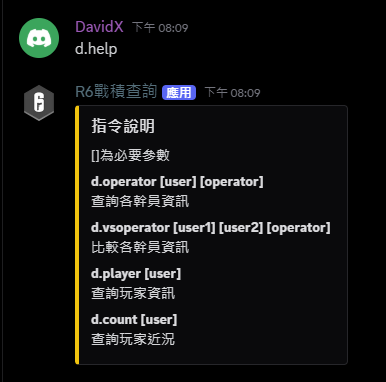
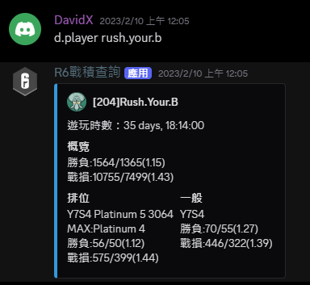
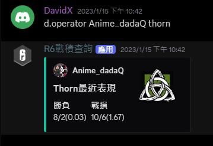
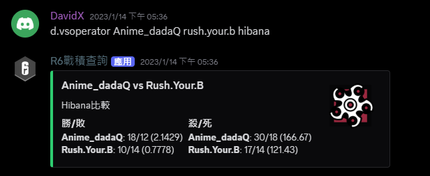
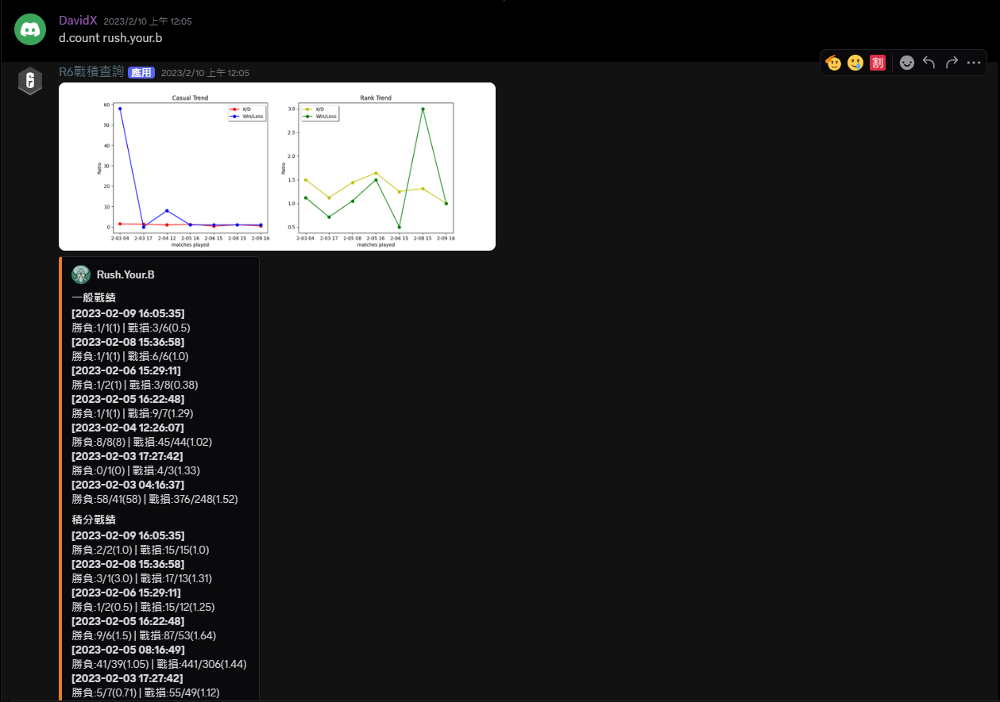

# R6 戰績查詢 Discord Bot

一個查詢《Rainbow Six Siege》玩家戰績的 Discord 機器人，使用 [discord.py](https://github.com/Rapptz/discord.py) 與 [siegeapi](https://github.com/CNDRD/siegeapi) 開發。

- 指令前綴：`d.`
- 可查詢玩家總覽、排位 / 一般場戰績、幹員數據、兩位玩家的幹員比較
- 可記錄玩家每次查詢之間的戰績變化，並繪製 K/D 與勝率趨勢圖

## 指令一覽

`[]` 為必要參數。

| 指令 | 說明 |
|---|---|
| `d.help` | 顯示指令說明 |
| `d.player [user]` | 查詢玩家資訊：遊玩時數、全賽季概覽、排位（段位 / 分數 / 最高段位）與一般場的勝負、K/D |
| `d.operator [user] [operator]` | 查詢玩家指定幹員的勝負與戰損 |
| `d.vsoperator [user1] [user2] [operator]` | 比較兩位玩家同一幹員的勝負與戰損 |
| `d.count [user]` | 結算與上次查詢之間的戰績變化（一般 / 排位分開），並產生趨勢圖 |

## 功能展示

> 以下截圖為舊版畫面，實際顯示欄位以目前版本為準。

### 指令說明 `d.help`

```
d.help
```



### 玩家資訊 `d.player`

顯示玩家等級、遊玩時數，以及全賽季概覽、當季排位與一般場的勝負、K/D。

```
d.player rush.your.b
```



### 幹員資訊 `d.operator`

顯示玩家指定幹員的勝負、戰損與比率，幹員名稱不分大小寫。

```
d.operator rush.your.b hibana
```



### 幹員比較 `d.vsoperator`

比較兩位玩家使用同一幹員的勝負與戰損。

```
d.vsoperator KuasDavidX ji_for iq
```



### 近況統計 `d.count`

每次查詢時與資料庫中上一筆紀錄相減，若有新對戰則寫入一筆新紀錄；一般場與排位各保留最近 10 筆。
回覆內容包含每段期間的勝負 / 戰損，並附上一般場與排位的 K/D、勝率趨勢圖。

```
d.count rush.your.b
```



## 環境需求

- Python 3.8+
- Ubisoft 帳號（用於透過 siegeapi 登入查詢資料）
- Discord Bot Token，並在 [Discord Developer Portal](https://discord.com/developers/applications) 的 Bot 設定中開啟 **Message Content Intent**

## 安裝與設定

### 1. 下載專案並安裝套件

```bash
git clone https://github.com/DavidQiu23/R6Discord-Bot.git
cd R6Discord-Bot
pip install -r requirements.txt
```

### 2. 設定環境變數

| 變數 | 說明 |
|---|---|
| `DISCORD_KEY` | Discord Bot Token |
| `R6_ACCOUNT` | Ubisoft 帳號（Email） |
| `R6_PASSWORD` | Ubisoft 密碼 |

Linux / macOS：

```bash
export DISCORD_KEY="your-discord-bot-token"
export R6_ACCOUNT="your-ubisoft-email"
export R6_PASSWORD="your-ubisoft-password"
```

Windows（PowerShell）：

```powershell
$env:DISCORD_KEY="your-discord-bot-token"
$env:R6_ACCOUNT="your-ubisoft-email"
$env:R6_PASSWORD="your-ubisoft-password"
```

### 3. 建立資料庫

`d.count` 使用專案根目錄下的 SQLite 資料庫 `r6.db`，程式不會自動建立資料表，首次使用前請先建立：

```bash
sqlite3 r6.db
```

```sql
CREATE TABLE USER_INFO (
    USER_ID     TEXT,
    USER_NAME   TEXT,
    GAME_TYPE   TEXT,     -- 'C' 一般場 / 'R' 排位
    WINS        INTEGER,
    LOSSES      INTEGER,
    KILLS       INTEGER,
    DEATHS      INTEGER,
    WINS_DIFF   INTEGER,
    LOSSES_DIFF INTEGER,
    KILLS_DIFF  INTEGER,
    DEATHS_DIFF INTEGER,
    TIME        TEXT
);
```

## 執行

```bash
python main.py
```

啟動成功後終端機會顯示機器人名稱與 ID，機器人狀態會顯示為「正在玩 d.help」。

## 專案結構

```
R6Discord-Bot/
├── main.py            # 機器人主程式
├── requirements.txt   # 相依套件
├── image/             # README 截圖
├── r6.db              # SQLite 資料庫（需自行建立，已加入 .gitignore）
├── trend.png          # d.count 產生的趨勢圖（執行時產生）
└── creds/             # siegeapi 登入快取（執行時產生）
```

## 參考

- [discord.py](https://github.com/Rapptz/discord.py)
- [siegeapi](https://github.com/CNDRD/siegeapi)
